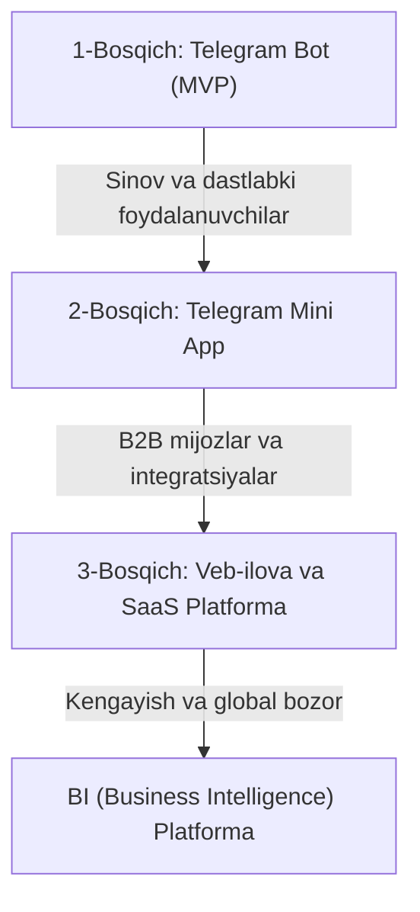

# AI Data Analyst: Startup Business & Technical Documentation

Ushbu hujjat loyihaning biznes tahlili, bozor strategiyasi, moliyaviy prognozlari, texnik arxitekturasi va 1 haftalik MVP rivojlanish rejasini o'z ichiga olgan mukammal startap qo'llanmasidir.

---

# Project Analysis

# AI Data Analyst Telegram Bot: Startap Tahlili va Rivojlanish Istiqbollari

Ushbu hujjatda Excel/CSV fayllarini tahlil qiluvchi AI Telegram bot loyihasining startap sifatidagi kelajagi, monetizatsiya imkoniyatlari, bozor talabi va investitsiya jalb qilish salohiyati tahlil qilingan.

---

## 1. Bozordagi Raqobat: Oldin kimdir bunday loyiha qilganmi?

Ha, jahon miqyosida shunga o'xshash texnologiyalardan foydalanadigan mahsulotlar mavjud:
- **ChatGPT Advanced Data Analysis (Code Interpreter):** Foydalanuvchilarga fayllarni yuklab, chat orqali tahlil qilish imkonini beradi.
- **Julius AI:** Ma'lumotlarni tahlil qilish va vizualizatsiya qilishga ixtisoslashgan mashhur veb-platforma.
- **PandasAI:** Ishlab chiquvchilar uchun Python kutubxonasi.

### Bizning loyihaning farqi (Unique Value Proposition - UVP):
Jahon brendlari asosan **veb-sayt** orqali ishlaydi va kompyuter talab qiladi. Telegram bot va keyinchalik **Telegram Mini App (TMA)** ko'rinishidagi mahsulot esa:
1. **Mobil moslashuvchanlik:** Telefon orqali istalgan joyda Excel faylni yuborib, 5 soniyada chiroyli grafik va tahlil olish.
2. **Mahalliylashtirish (Localization):** O'zbekiston va MDH bozorida o'zbek/rus tillarida mukammal tahlil qiluvchi va mahalliy buxgalteriya/savdo tizimlariga (masalan, 1C, Jowi, Express24) moslashgan yechim yo'q.
3. **Qulaylik:** Yangi saytda ro'yxatdan o'tish shart emas, Telegram'ning o'zida hammasi tayyor.

---

## 2. Kelajakdagi Mini Ilova (Telegram Mini App - TMA) Rivojlanishi

Telegram botni keyinchalik osongina **Telegram Mini App** ko'rinishiga o'tkazish mumkin. Telegram Mini App — bu Telegram ichida yuklanadigan veb-sayt (React/Vite yordamida yozilgan).

### TMA ko'rinishida nimalar qo'shiladi:
- **Interaktiv Jadval:** Excel faylni ochib, ichidagi ma'lumotlarni Telegram ichida to'g'ridan-to'g'ri o'zgartirish va tahrirlash imkoniyati.
- **Dinamik Grafiklar:** Foydalanuvchi sichqoncha/barmog'i bilan boshqara oladigan Chart.js yoki Recharts grafiklari.
- **Sozlamalar paneli:** AI qaysi modeldan foydalanishini tanlash (Gemini, GPT-4, Claude).

---

## 3. Rivojlanish Yo'l Xaritasi (Roadmap)



---

## 4. Daromad Manbalari va Monetizatsiya (Revenue Model)

Loyiha quyidagi yo'llar orqali daromad keltirishi mumkin:

| Model | Tavsif | Taxminiy Narx (O'zbekiston bozori uchun) |
| :--- | :--- | :--- |
| **Freemium** | Har oy 3 ta bepul fayl tahlili. | Bepul |
| **Premium Subscriptions (B2C)** | Cheksiz tahlillar, katta hajmdagi fayllar, eksklyuziv grafik turlari. | $3 - $7 / oyiga |
| **B2B Integratsiya** | Tadbirkorlar uchun o'zlarining 1C, Google Sheets yoki CRM tizimlarini ulash va avtomatik hisobot olish. | $20 - $50 / oyiga |
| **On-Premise (Enterprise)** | Yirik kompaniyalar (banklar, logistika) uchun ma'lumotlar xavfsizligini ta'minlash maqsadida ularning shaxsiy serveriga o'rnatib berish. | $1,000+ bir marta |

---

## 5. Bozor Talabi: Foydalanuvchilar buni tashlab ketmaydimi?

**Excel — dunyodagi eng mashhur biznes vositasi.** Biroq, biznes egalari, menejerlar va sotuvchilarning 90% qiyin formulalar yozishni yoki pivot jadvallar tuzishni bilishmaydi. Ularga oddiy savol berib javob olish osonroq.

### Mijozlarni ushlab qolish (Retention) sirlari:
1. **Google Sheets ulanishi:** Foydalanuvchi faqat bir marta o'zining savdo Google Sheets jadvalini ulaydi. Bot har kuni ertalab avtomatik ravishda savdo tahlili va grafikni Telegram'ga yuboradi.
2. **Avtomatik Hisobotlar:** Haftalik/oylik hisobotlarni tayyorlab berish eslatmalari.
3. **Kollektiv Ishlash:** Botni guruhlarga qo'shish imkoniyati (masalan, rahbarlar guruhida savdo jadvalini tashlab, hamma tahlilni birga ko'rishi).

---

## 6. Startap Sifatida Investitsiya Olish Imkoniyati

Ha, loyiha investitsiya jalb qila oladi. Buning uchun quyidagi ko'rsatkichlarni (Metrics) ko'rsatish kerak bo'ladi:
- **DAU/MAU:** Kunlik va oylik faol foydalanuvchilar soni (masalan, 10,000 faol foydalanuvchi).
- **MRR (Monthly Recurring Revenue):** Oylik barqaror daromad ($1,000+).
- **LTV/CAC koeffitsiyenti:** Mijoz keltiradigan foydaning uni jalb qilish xarajatidan kamida 3 barobar ko'pligi.

### Qayerdan investitsiya olish mumkin:
- **Mahalliy fondlar:** AloqaVentures, UzVC, MDH mintaqasidagi venchur fondlar.
- **Akseleratorlar:** IT Park akseleratsiyalari, Y Combinator (global bozorga chiqa olsak).

---

## Xulosa va Kelajakdagi Katta Loyiha

Bu loyiha oddiy bot emas. U kelajakda **AI-driven BI (Business Intelligence) Platformasiga** aylanishi mumkin. Ya'ni, kompaniyalar qimmat va qiyin PowerBI yoki Tableau tizimlari o'rniga, sizning sodda, chat va ovozli buyruqlar orqali ishlaydigan tahlil tizimingizdan foydalanishadi.


---


# Market And Product Analysis

# AI Data Analyst: Bozorni Chuqur Tahlil Qilish va Mahsulot Arxitekturasi

Ushbu tahliliy hujjat loyihaning tariflar tizimi, texnologik arxitekturasi, interaktiv grafiklar integratsiyasi, Telegram Mini App'dan mustaqil SaaS ilovaga o'tish strategiyasi hamda monetizatsiyani chuqur yoritadi.

---

## 1. Mahsulot Tariflari Tizimi (Product Tiers)

Foydalanuvchilarni jalb qilish, ushlab qolish va server (AI API) xarajatlarini qoplash uchun quyidagi 3 bosqichli tariflar tizimini taklif qilamiz:

```
+---------------------------------------------------------------------------------+
|                                 TARIFLAR TIZIMI                                 |
+------------------------------------+--------------------------------------------+
| ODDIY (Free)                       | - Fayl yuklash (CSV/Excel)                 |
|                                    | - Statik (PNG) grafiklar                   |
|                                    | - Boshlang'ich AI matnli tahlil            |
+------------------------------------+--------------------------------------------+
| PREMIUM                            | - Kunlik ma'lumotlarni avtomat tahlil      |
|                                    | - Google Sheets va API ulanishlari        |
|                                    | - Kunlik tahliliy hisobotlar (push)        |
+------------------------------------+--------------------------------------------+
| PRO                                | - Interaktiv grafiklar (zoom, pan, touch)  |
|                                    | - Kunlik, haftalik va oylik tahlillar      |
|                                    | - Jamoaviy guruhlar bilan ishlash          |
+------------------------------------+--------------------------------------------+
```

### O'tish Mantiqi (Foyda Keltirish Nuqtasi):
- **Oddiy** tarif foydalanuvchilarning "og'zini tegizish" (Lead Generation) uchun xizmat qiladi. Statik PNG rasmlar o'qishga oson, lekin dinamik emas.
- **Premium** foydalanuvchiga har kuni ma'lumotlarni qo'lda yuklashdan qutulish imkonini beradi. Avtomatlashtirish uning vaqtini tejaydi.
- **Pro** esa eng yuqori biznes tahlil darajasi bo'lib, foydalanuvchiga ma'lumotlar ustida to'liq vizual nazorat (Interaktivlik) va strategik (Haftalik, Oylik) xulosalar taqdim etadi.

---

## 2. Interaktiv Grafiklar Texnologiyasi (Pro Tarif uchun)

Telegram Mini App (TMA) asosan mobil qurilmalardagi WebView orqali ishlagani sababli, grafiklar sensorli ekranlarda (touch screen) juda silliq va tez ishlashi kerak.

### Tavsiya etiladigan kutubxonalar (React/JS uchun):
1. **Recharts (Recommended):** React uchun maxsus yaratilgan, juda yengil va responsive. Sensorli surish (swipe) va zoom qilishni yaxshi qo'llab-quvvatlaydi.
2. **Apache ECharts:** Millionlab qatorli ma'lumotlar bilan ishlaganda ham qotmaydigan, Canvas renderlash texnologiyasiga ega juda kuchli tizim.
3. **ApexCharts:** Chiroyli micro-animatsiyalar va dashboardlar uchun tayyor vizual effektlari mavjud.

### Ishlash prinsipi:
Foydalanuvchi ma'lumotni tahrirlaganda yoki grafikdagi biror ustunga bosganda (touch), AI orqa fonda ma'lumotlarni qayta hisoblab chiqadi va grafik real vaqt rejimida o'zgaradi. Telegram UI ranglariga moslashib, foydalanuvchi qorong'u rejimga (Dark Mode) o'tsa, grafiklar ham avtomatik qorong'ulashadi.

---

## 3. Telegram Mini App -> Mustaqil SaaS Ilovaga O'tish Arxitekturasi

Loyihani boshidanoq to'g'ri loyihalash kelajakda uni Telegram'dan mustaqil ilovaga aylantirishni juda osonlashtiradi. Buni **Headless API (Microservices)** arxitekturasi orqali hal qilamiz.

```mermaid
graph TD
    subgraph Backend [Markaziy Tahlil Platformasi (FastAPI / Django)]
        A["Core AI Engine (Gemini API)"]
        B["Data Processing (Pandas/SQL)"]
        C["User & Subscription Database"]
    end

    subgraph Clients [Mijozlar interfeysi]
        D["Telegram Bot Client"]
        E["Telegram Mini App (TMA React)"]
        F["Standalone Web App (SaaS sayt)"]
        G["Mobile App (Flutter/React Native)"]
    end

    D -->|REST API Requests| Backend
    E -->|REST API Requests| Backend
    F -->|REST API Requests| Backend
    G -->|REST API Requests| Backend
```

### Texnik yechim:
- **Backend:** Barcha tahliliy mantiq, fayllarni qayta ishlash, Gemini API va Pandas skriptlari alohida mustaqil serverda (masalan, FastAPI yoki Django REST Framework yordamida) yoziladi.
- **Frontend (TMA):** Telegram Mini App shunchaki ushbu Backend API'dan ma'lumot olib ko'rsatadigan mijozdir.
- **Mustaqil Ilovaga O'tish:** Biz kelajakda yangi `analyst-saas.com` saytini yoki mobil ilovani ishga tushirganimizda, backend kodiga umuman tegmaymiz. Shunchaki yangi ilovani xuddi shu Backend API'ga ulaymiz.

---

## 4. Bozor Tahlili: Nega aynan hozir va qanday muammoni yechamiz?

### Global Bozor Tendensiyasi:
- AI asosidagi tahliliy dasturlar (Business Intelligence - BI) bozori 2025-yilda **$31.22 mlrd** ni tashkil etgan bo'lsa, 2034-yilga kelib **$310.97 mlrd** ga yetishi va yillik **29.1% (CAGR)** o'sishi prognoz qilinmoqda.
- Kichik va o'rta biznes (SME) an'anaviy PowerBI va Tableau kabi tizimlardan charchamoqda. Chunki ularni o'rganish juda qiyin, professional tahlilchini yollash esa qimmatga tushadi.
- Bozor hozirda **"Conversational BI"** (savol berish orqali tahlil olish) tomon shiddat bilan siljimoqda.

### Mijozlarning talabi: Ular botni tashlab ketmaydimi?
Oddiy chat-botlarni tezda unutishadi (Retention past bo'ladi). Ammo **ish jarayoniga integratsiya qilingan** tizimlardan har kuni foydalanishadi. 

**Talabni barqaror ushlab turish mexanizmlari:**
1. **Google Sheets avtomatik sinxronizatsiyasi:** Mijoz har kuni fayl yuklamaydi. U o'zining do'koni, marketing jadvallarini ulab qo'yadi. Bot har kuni ertalab soat 9:00 da o'tgan kungi savdolarni tahlil qilib, Telegram'iga tayyor diagramma yuboradi.
2. **Kompaniya ichidagi hamkorlik:** Guruhlarga qo'shilganda bot jamoaga haftalik hisobotlarni avtomat chiqarib beradi.

---

## 5. Monetizatsiya va Moliyaviy Xavfsizlik (Pricing Strategy)

AI loyihalarda eng katta xavf — foydalanuvchilarning juda ko'p so'rov yuborishi sababli API xarajatlarining oshib ketishi (Token burn rate).

### Biz qo'llaydigan Gibrid Monetizatsiya (Hybrid Pricing):
Biz faqat obuna (fixed subscription) emas, balki **Kredit tizimi (Credit-based + Subscription)** tizimini joriy qilamiz:
* Har bir obuna foydalanuvchiga oyiga ma'lum miqdorda **"Tahlil Kreditlari"** beradi (masalan, Premiumda 500 ta kredit, Prodada 2000 ta kredit).
* Gemini API yordamida qilingan har bir murakkab so'rov ma'lum miqdordagi kreditni kamaytiradi.
* Kredit tugaganda foydalanuvchi qo'shimcha kredit paketlarini (Top-up) sotib oladi.
* Bu bizni moliyaviy zarar ko'rishdan 100% himoya qiladi.

### O'zbekiston bozori uchun narxlash strategiyasi (Gipoteza):
- **Free:** Cheklangan.
- **Premium:** 89,000 so'm / oyiga (Menejerlar va kichik do'kon egalari uchun).
- **Pro:** 249,000 so'm / oyiga (Katta savdogarlar, tahlilchilar va jamoaviy guruhlar uchun).


---


# Comprehensive Market And Tech Analysis

# AI Data Analyst: Keng Qamrovli Bozor va Texnologik Tahlil (Deep Dive Analysis)

Ushbu tahlil loyihani MVP (Minimum Viable Product) bosqichidan global SaaS platformasi darajasiga ko'tarish uchun zarur bo'lgan bozor raqobati, texnik xavfsizlik (sandbox), mahsulot tariflari va marketing strategiyasini chuqur yoritadi.

---

## 1. Global Raqobatchilar Tahlili (Competitor Analysis)

Global bozorda ma'lumotlarni AI yordamida tahlil qiluvchi yetakchi tizimlarning ishlash mexanizmlari va moliyaviy muvaffaqiyatlari:

### 1. Julius AI (Yetakchi AI Ma'lumot Tahlilchisi)
*   **Mexanizm:** Foydalanuvchilar fayllarni (Excel, CSV, SQL, PDF) yuklaydi va u bilan "suhbatlashadi". Orqa fonda tizim GPT-4/Claude modellari yordamida Python kodini generatsiya qiladi va uni xavfsiz virtual mashinada (VM) ishga tushiradi.
*   **Narxlar:** Cheklangan bepul so'rovlar, Premium tarif $20/oyiga, Pro tarif $45/oyiga.
*   **Kuchli tomoni:** Kodlarning shaffofligi (foydalanuvchi orqa fonda yozilgan Python kodini ko'ra oladi).

### 2. Formula Bot (Excel Formula Bot)
*   **Tarixi:** 2022-yilda David Bressler (oddiy ma'lumot tahlilchisi) tomonidan paternity leave (ota ta'tili) vaqtida Bubble platformasida no-code yordamida 6 haftada yaratilgan.
*   **Rivojlanishi:** Avvaliga faqat oddiy Excel formulalarini generatsiya qiluvchi vosita bo'lgan. Keyinchalik mijozlar talabi bilan to'liq ma'lumotlar tahlili va vizualizatsiyaga o'tgan.
*   **Daromadi:** Bugungi kunda **$226,000+ oylik takroriy daromad (MRR)** oladi va jamoada deyarli 1-2 kishi ishlaydi.
*   **Marketing kanali:** TikTok, Reddit va SEO orqali organik (bepul) ravishda millionlab foydalanuvchilarni jalb qilgan.

---

## 2. Tariflar Tizimi va Funksiyalar (Detailed Tier Strategy)

Bozordagi tajribalarga tayanib, Premium va Pro tariflar uchun quyidagi tizimni taklif qilamiz:

| Tarif | Narxi (Gipoteza) | Tahlil Turi | Grafik Turi | Qo'shimcha Imkoniyatlar |
| :--- | :--- | :--- | :--- | :--- |
| **Oddiy (Free)** | Bepul | Oddiy matnli tahlil | Statik (PNG rasm) | Cheklangan fayl hajmi (maks. 5MB) |
| **Premium** | ~ 89 000 so'm/oy | Avtomatik kunlik tahlil | Statik va oddiy interaktiv | Google Sheets va 1C integratsiyasi, kunlik eslatmalar |
| **Pro** | ~ 249 000 so'm/oy | Kunlik, haftalik va oylik tahlillar | To'liq interaktiv grafiklar | Jamoaviy guruhlar, eksport (PDF/Excel), API ulanish |

### Pro Tarifdagi Interaktiv Grafiklar:
- Biz foydalanuvchiga faqat rasm yubormaymiz. **Pro** tarif egalari Telegram Mini App ichida **Recharts** yoki **Apache ECharts** orqali yaratilgan grafikni sensorli ekran orqali boshqara oladi.
- Grafik ustidagi elementlarga bosganda (touch), AI orqa fonda hisob-kitobni o'zgartiradi.

---

## 3. Texnik Arxitektura va Python Sandbox Xavfsizligi

AI generatsiya qilgan Python kodlarini serverda to'g'ridan-to'g'ri ishga tushirish **juda xavfli**. Chunki zararli kod (masalan, `os.system("rm -rf /")`) butun serverimizni yo'q qilishi yoki ma'lumotlarni o'g'irlashi mumkin. Shuning uchun xavfsiz sandbox muhitini qurish zarur.

```
+---------------------------------------------------------------------------------+
|                                 SANDBOX TAQQOSLASH                              |
+---------------------+-------------------------+---------------------------------+
| Texnologiya         | Xavfsizlik Darajasi     | Ishlash Tezligi                 |
+---------------------+-------------------------+---------------------------------+
| Standart Docker     | Past (Kernelni baham    | Yuqori                          |
|                     | ko'radi)                |                                 |
+---------------------+-------------------------+---------------------------------+
| gVisor (Google)     | Yuqori (Syscall'larni   | O'rtacha                        |
|                     | nazorat qiladi)         |                                 |
+---------------------+-------------------------+---------------------------------+
| MicroVMs            | Juda yuqori (Alohida    | O'rtacha-Tez                    |
| (Firecracker)       | kernel)                 |                                 |
+---------------------+-------------------------+---------------------------------+
| WebAssembly (Wasm)  | Eng yuqori (Faqat       | O'rtacha (Pyodide orqali)       |
|                     | brauzerda ishlaydi)     |                                 |
+---------------------+-------------------------+---------------------------------+
```

### Bizning loyiha uchun tavsiya etiladigan arxitektura:
Ishlab chiqish boshida xavfsiz Sandbox xizmatini noldan yozish vaqt va resurs jihatidan qimmatga tushadi. Shuning uchun tayyor **E2B Sandbox** yoki **Modal** kabi AI agentlari uchun xavfsiz mikro-konteynerlar xizmatidan foydalanish maqsadga muvofiqdir. Keyinchalik platforma kengaygach, o'zimizning **gVisor** asosidagi xavfsiz Docker serverimizni ishga tushiramiz.

---

## 4. Telegram Mini App'dan Mustaqil SaaS Ilovaga Rivojlanish Yo'li

Mahsulotni faqat Telegram ichida ushlab turmaslik kerak. Biz **Headless API** yondashuvidan foydalanamiz:

1.  **Markaziy API Server (FastAPI / Django):** Tahliliy algoritmlar, ma'lumotlar bazasi va Gemini API faqat shu yerda ishlaydi.
2.  **Mijozlar (Frontends):**
    -   **1-bosqich:** Telegram Bot va Telegram Mini App (React). Ular foydalanuvchiga Telegram ichida eng oson yo'l bilan yetib boradi.
    -   **2-bosqich:** Mustaqil Veb-Ilova (SaaS). Professional tahlilchilar va korxonalar kompyuter orqali keng ekranda ishlash uchun ushbu platformaga o'tishadi.
    -   **3-bosqich:** Mobil ilovalar (iOS / Android).

Foydalanuvchi ma'lumotlari bitta umumiy backend bazasida saqlangani uchun u Telegram'da boshlagan tahlilini kompyuterda davom ettira oladi.

---

## 5. Mijozlarni Jalb Qilish va Ushlab Qolish (Growth & Retention)

Tahliliy botlarning eng katta muammolaridan biri — foydalanuvchilarning botni tezda unutishi. Buning oldini olish uchun quyidagi mexanizmlarni joriy etamiz:

### 1. Passiv Eslatmalar (Passive Automation)
Foydalanuvchi o'z ma'lumotlarini (masalan, Google Sheets) faqat bir marta ulaydi. Bot har kuni yoki har haftada belgilangan vaqtda (masalan, dushanba kuni soat 9:00 da) avtomatik ravishda haftalik savdolar tahlili va interaktiv grafikni Telegram'iga tashlaydi. Bu foydalanuvchidan hech qanday harakat talab qilmaydi va unga doimiy qiymat beradi.

### 2. Jamoaviy Guruhlar Integratsiyasi (Collaborative Analytics)
Botni Telegram guruhlariga qo'shish imkoniyatini yaratamiz. Rahbar yoki sotuvchilar guruhga savdo hisobotlarini yuborganda, bot butun guruh uchun umumiy tahlil va grafikni chiqaradi. Bu loyihaning guruh a'zolari orasida **virusli (viral) o'sishiga** sabab bo'ladi.

### 3. Kontent Marketing (SEO va TikTok)
Formula Bot kabi loyihalarning muvaffaqiyati bevosita TikTok va ijtimoiy tarmoqlardagi vizual videolar bilan bog'liq. "Excelda 3 soatlik ishni AI bot orqali 5 soniyada bajarish" mavzusidagi qisqa videolar loyihaga minglab bepul mijozlarni olib keladi.


---


# Uzbekistan Market Strategy

# O'zbekiston Bozori va B2B Hamkorlik Strategiyasi

Ushbu hujjatda loyihaning O'zbekiston bozoridagi salohiyati, mahalliy raqobat, maqsadli auditoriya va kompaniyalar bilan hamkorlik qilish imkoniyatlari tahlil qilingan.

---

## 1. O'zbekiston Bozoridagi Mavjud Raqobatchilar

Hozirgi kunda O'zbekiston bozorida **AI asosidagi, o'zbek/rus tillarida Excel tahlilini amalga oshiruvchi mahalliy ilova yoki bot umuman yo'q**.

Mavjud an'anaviy yechimlar:
1.  **Qimmat BI tizimlari (PowerBI, Tableau):** Faqat yirik kompaniyalar (banklar, yirik sug'urta kompaniyalari, Korzinka, Makro va h.k.) foydalanadi. Ularga xizmat ko'rsatish uchun alohida Ma'lumotlar tahlili (Data Analytics) bo'limi yoki autsorsing agentliklari kerak. Bu kichik biznes uchun o'ta qimmat.
2.  **POS/ERP Tizimlarining ichki hisobotlari (Jowi, Billz, Poster, 1C):** Do'kon va restoranlar foydalanadigan ushbu dasturlarda faqat standart, statik jadvallar bor. AI yordamida o'zbekcha savol berib ("Qaysi filialda qaysi taom ko'proq sotildi va nega?"), chuqur tahlil va bashorat olib bo'lmaydi.

---

## 2. Bozorni Qanchalik Egallay Olamiz? (Market Share Estimation)

O'zbekistonda kichik va o'rta biznes (KOB) shiddat bilan rivojlanmoqda:
*   **Bozor hajmi:** O'zbekistonda 500,000 dan ortiq ro'yxatdan o'tgan faol kichik tadbirkorlar va fermerlar mavjud. Ularning kamida 60-70% o'z hisob-kitoblarini Excel, Google Sheets yoki sodda daftarlarda yuritadi.
*   **Bizning maqsad (1% qoidasi):** Agar biz ushbu bozorning bor-yo'g'i **1% qismini (5,000 ta tadbirkor)** jalb qila olsak va ularga Premium/Pro tariflarni oyiga o'rtacha 100,000 so'mdan ($8) taklif qilsak:
    $$\text{Oylik takroriy daromad (MRR)} = 5,000 \times 100,000 \text{ so'm} = 500,000,000 \text{ so'm} \approx \$40,000$$
    Bu juda real va 2-3 kishilik jamoa uchun o'ta daromadli ko'rsatkichdir.

---

## 3. Kompaniyalar va Tashkilotlar bilan Hamkorlik (B2B Partnerships)

Biznesni tezroq o'stirish va yirik mijozlarni jalb qilish uchun quyidagi tashkilotlar bilan hamkorlik (integratsiya) qilishimiz mumkin:

### A. POS va CRM Tizimlari (Retail & Restoranlar):
*   **Hamkorlar:** `Jowi`, `Poster` (restoranlar uchun), `Billz` (kiyim do'konlari uchun), `Easy Trade`.
*   **Mexanizm:** Ularning App Store (ilovalar do'koni) tizimiga o'z yechimimizni integratsiya qilamiz. Restoran yoki do'kon egasi o'z savdo ma'lumotlarini avtomat tarzda bizning botga ulaydi va har kuni ertalab Telegram'ida AI tahlilini oladi.

### B. Buxgalteriya va Soliq Dasturlari:
*   **Hamkorlar:** `1C`, `Didox`, `Solq.uz` API.
*   **Mexanizm:** Buxgalterlar uchun oylik xarajatlar va daromadlar Excel jadvallarini avtomatik tahlil qiluvchi maxsus plaginlar yaratish.

### C. To'lov tizimlari va Banklar:
*   **Hamkorlar:** `Click`, `Payme`, `Uzum Business`, `Aloqabank`, `Anorbank`.
*   **Mexanizm:** Banklarning biznes-mijozlari uchun "Aqlli moliyaviy tahlilchi" qo'shimcha xizmatini taklif qilish. Masalan: Uzum Business ilovasi ichida tadbirkorga o'z tushumlarini grafik ko'rinishida tahlil qilib berish.


---


# Team Structure

# AI Data Analyst: Jamoa Tarkibi va Kengayish Strategiyasi (Team Structure & Growth)

Ushbu hujjat loyihani MVP (boshlang'ich mahsulot) bosqichidan boshlab yirik SaaS startap darajasiga ko'tarish uchun qanday mutaxassislar va qancha a'zodan iborat jamoa kerakligini belgilaydi.

---

## 1. 1-Bosqich: MVP va Sinov (Pre-launch Phase)
*   **Maqsad:** 1 oy ichida ishlovchi Telegram bot va sodda Mini App interfeysini yaratish, dastlabki 100-500 faol foydalanuvchini jalb qilib gipotezalarni sinash.
*   **Jamoa a'zolari soni:** **1-2 kishi** (Bootstrapping bosqichi).

### Rollar:
1.  **Asoschi (Founder):** Mahsulot g'oyasi, strategiya va loyiha boshqaruvi.
2.  **Full-Stack Dasturchi (Siz + Men):** 
    -   Orqa fon (Backend): Python (FastAPI/Django), Pandas va Telegram API.
    -   Interfeys (Frontend): React/Vite orqali Telegram Mini App yaratish.
    
> [!TIP]
> *Formula Bot* loyihasi oyiga $226k MRR daromadga yetguncha ham jamoada faqat 1 kishi (asoschining o'zi) ishlagan. Dastlabki bosqichda ko'p odam yollash startap byudjetini tezda tugatib qo'yadi.

---

## 2. 2-Bosqich: Ishga tushirish va O'sish (Launch & Growth)
*   **Maqsad:** Foydalanuvchilar sonini 5,000+ ga yetkazish, Premium va Pro obunalardan barqaror daromadga chiqish, dastlabki B2B mijozlarni topish.
*   **Jamoa a'zolari soni:** **3-4 kishi**.

### Rollar:
1.  **Backend & AI Engineer:** FastAPI serveri, Python Sandbox xavfsizligi va Gemini API ulanishini optimallashtirish (xarajatlarni kamaytirish).
2.  **Frontend Web Developer:** Telegram Mini App ichidagi interaktiv grafiklarni (Recharts/ECharts), tahrirlash jadvallarini mukammal va tez ishlaydigan qilish.
3.  **Growth Marketer / SMM:** TikTok, Reels, YouTube va Telegram kanallar uchun qisqa videolar (Shorts) tayyorlash, bepul organik trafik jalb qilish.
4.  **UI/UX Designer (Part-time):** Ilovaning vizual premium ko'rinishini loyihalash.

---

## 3. 3-Bosqich: Kengayish va Mustaqil SaaS (Scale & Standalone)
*   **Maqsad:** Loyihani Telegram'dan mustaqil veb-sayt va mobil ilovaga o'tkazish, investitsiya jalb qilish, B2B korporativ savdoni yo'lga qo'yish.
*   **Jamoa a'zolari soni:** **5-8 kishi**.

### Rollar:
```
                               +-----------------------------+
                               |     FOUNDER & CEO (Siz)     |
                               +--------------+--------------+
                                              |
       +-----------------------+--------------+---------------+-----------------------+
       |                       |                              |                       |
+------v------+         +------v------+                +------v------+         +------v------+
| Tech Team   |         | Design Team |                | Growth/Sales|         | Support     |
+------+------+         +------+------+                +------+------+         +------+------+
       |                       |                              |                       |
       |- Lead Backend         |- UI/UX Designer              |- B2B Sales Manager    |- Support &
       |- Frontend Engineer                                   |- Marketing Lead         Community
       |- DevOps (Sandbox)                                                              Manager
```

-   **Tech Team (Dasturchilar):** Backend, Frontend va DevOps (Sandbox xavfsizligi va serverlarni bulutda kengaytirish uchun).
-   **B2B Sales Manager:** Yirik korxonalar, savdo tarmoqlari va banklarga platformani sotish.
-   **Support & Community Manager:** Telegram guruhlarda foydalanuvchilar muammolarini hal qilish (mijozlar sodiqligini oshirish).


---


# First Month Financial Scenarios

# Birinchi Oy Uchun Moliyaviy Ssenariylar Tahlili

Ushbu tahlilda loyihamiz ishga tushgan birinchi oy (launch month) uchun 3 xil (Pessimist, Realist va Optimist) moliyaviy prognoz taqdim etiladi.

---

## Ssenariylar Solishtirma Jadvali (1-oy uchun)

| Ko'rsatkich | 1. Pessimist Ssenariy (Past) | 2. Realist Ssenariy (O'rtacha) | 3. Optimist Ssenariy (Yuqori) |
| :--- | :--- | :--- | :--- |
| **A'zolar soni** | 10 ta (8 Prem, 2 Pro) | 50 ta (40 Prem, 10 Pro) | 200 ta (150 Prem, 50 Pro) |
| **Pul aylanmasi (Revenue)**| 1,210,000 so'm | 6,050,000 so'm | 25,800,000 so'm |
| **Hosting & Domain** | 217,000 so'm | 217,000 so'm | 409,000 so'm (Server scaling) |
| **Gemini API xarajati** | 13,000 so'm (200 tahlil) | 64,000 so'm (1500 tahlil) | 320,000 so'm (7000 tahlil) |
| **To'lov komissiyasi (2.5%)**| 30,250 so'm | 151,250 so'm | 645,000 so'm |
| **Marketing / Reklama** | 0 so'm | 200,000 so'm | 500,000 so'm |
| **Jami Xarajatlar** | **260,250 so'm** | **632,250 so'm** | **1,874,000 so'm** |
| **Sof Foyda (Net Profit)** | **949,750 so'm** | **5,417,750 so'm** | **23,926,000 so'm** |
| **Foydalilik marjasi** | **78.5%** | **89.5%** | **92.7%** |

---

## Ssenariylarning Batafsil Tahlili

### 1. Pessimist Ssenariy (Eng past ko'rsatkich)
Bu holatda reklama yoki viral marketing kutilgandek ishlamaydi va faqat 10 ta yaqin do'stlar/kichik tadbirkorlar obuna sotib oladi.
*   **Moliyaviy holat:** Aylanma kichik bo'lsa ham, xarajatlarimiz minimal bo'lgani uchun loyiha zarar ko'rmaydi (Break-even nuqtasidan o'tgan).
*   **Xulosa:** ~950,000 so'm sof foyda. Loyiha o'z xarajatlarini to'liq qoplaydi va keyingi oylarga texnik xatolarni tuzatib, marketing ustida ishlash uchun vaqt beradi.

### 2. Realist Ssenariy (O'rtacha / Kutilayotgan ko'rsatkich)
Soddaroq ijtimoiy tarmoq reklamalari va guruhlardagi tavsiyalar orqali 50 ta mijoz jalb etiladi. Bu startap uchun birinchi oy uchun normal ko'rsatkich.
*   **Moliyaviy holat:** Aylanma 6 mln so'mdan oshadi, server va API xarajatlari qoplanib, **5.4 mln so'm (~$425) sof foyda** qoladi.
*   **Xulosa:** Ushbu daromad loyihani yanada takomillashtirish, keyingi marketing byudjetini oshirish va jamoani part-time kengaytirish uchun yetarli bo'ladi.

### 3. Optimist Ssenariy (Yuqori ko'rsatkich)
TikTok yoki Telegram kanallarida e'lon qilingan videolarimizdan biri virusli tarqalib (trendga chiqib), birinchi oyning o'zidayoq 200 ta mijoz obunani sotib oladi.
*   **Moliyaviy holat:** Tushum 25.8 mln so'mni tashkil etadi. Ko'plab parallel so'rovlarni ko'tarish uchun server quvvatini oshiramiz (xarajat $15 dan $30 ga ko'tariladi).
*   **Xulosa:** **23.9 mln so'm (~$1,880) sof foyda.** Bu ko'rsatkich loyihaga to'liq vaqt (full-time) ajratishga, professional UI dizayner yollashga va investorlar uchun birinchi oyda ajoyib natija (traction) ko'rsatishga imkon beradi.


---


# Financial And Legal Feasibility

# Moliyaviy va Huquqiy Tahlil (Financial & Legal Feasibility Study)

Ushbu hujjatda loyihaning O'zbekiston sharoitidagi daromad va xarajatlari, soliqlari, to'lov tizimlari integratsiyasi, IT Park imtiyozlari va moliyaviy barqarorlik (Break-even) nuqtalari tahlil qilingan.

---

## 1. Daromad va Xarajatlar Modeli (Financial Model)

Dastlabki 6 oylik MVP va O'sish bosqichidagi oylik xarajatlar va daromadlar prognozi:

### A. Dastlabki Oylik Xarajatlar (Fixed & Variable Costs):
1.  **Server va Hosting (DigitalOcean / Hetzner):** ~$15 / oyiga (Boshlanishiga 2GB RAM, 2 CPU yetarli).
2.  **Ma'lumotlar Bazasi (SQLite/PostgreSQL):** Bepul (lokal serverda ishlaydi).
3.  **Domen (`.uz`):** ~25,000 so'm / yiliga (yiliga bir marta to'lanadi).
4.  **Google Gemini API (Tahlil va kod generatsiyasi xarajatlari):**
    *   *Gemini 2.5 Flash* narxlari: 1 million input token uchun ~$0.075, output uchun ~$0.30.
    *   Bitta Excel faylini tahlil qilish uchun o'rtacha 10,000 token ketadi (narxi ~$0.003).
    *   1000 ta so'rov uchun jami API xarajati: ~$3.00 (taxminan 38,000 so'm) bo'ladi.
5.  **Jami minimal oylik xarajat:** ~$25 (taxminan 320,000 so'm). Bu xarajatlar juda kichik bo'lib, loyihaning moliyaviy xavfi o'ta pastligini ko'rsatadi.

---

## 2. Tariflar va Daromad Prognozi (Revenue Streams)

O'zbekiston bozoridagi tadbirkorlar uchun narxlar threshold'ini (chegarasini) inobatga olgan holda:

*   **Premium Tarif (Kichik savdogarlar uchun):** 89,000 so'm / oyiga (Google Sheets avtomat eslatmalar bilan).
*   **Pro Tarif (Kompaniyalar va tahlilchilar):** 249,000 so'm / oyiga (Interaktiv grafiklar, oylik hisobotlar).

### Daromad ssenariysi (100 ta faol obunachi bilan):
*   75 ta Premium a'zo: $75 \times 89,000 = 6,675,000$ so'm
*   25 ta Pro a'zo: $25 \times 249,000 = 6,225,000$ so'm
*   **Jami oylik daromad:** **12,900,000 so'm** (~$1,000)
*   **Jami oylik API + Server xarajati:** ~450,000 so'm
*   **Sof foyda marjasi:** **96.5%**

---

## 3. O'zbekiston Bozori To'lashga Tayyormi? (Market Willingness to Pay)

Ha, lekin faqat ma'lum shartlar ostida:
-   **Matnli tahlil uchun pul to'lashmaydi:** Shunchaki chat orqali maslahat beruvchi botlarga odamlar pul to'lashni xohlamaydi.
-   **Vaqtni tejash va Avtomatlashtirish uchun pul to'lashadi:** Agar tadbirkorga *"Siz har kuni savdo jadvalini ochib o'tirmaysiz, botning o'zi har kuni 9:00 da Telegram'ingizga do'koningizdagi eng ko'p sotilgan tovarlar, kamomadlar va foyda haqida chiroyli diagramma yuboradi"* deb tushuntirilsa, oyiga 89,000 so'm to'lash ular uchun juda arzon (chunki ma'lumot tahlilchisiga kamida 5,000,000 so'm oylik to'lash kerak).

---

## 4. To'lov Tizimlari va Soliq (Payments & Taxes)

### A. To'lov tizimlari integratsiyasi:
1.  **Mahalliy B2C to'lovlar (Payme, Click, Apelsin/Uzum Bank):** 
    *   Ularning API'lari orqali Click/Payme billing tizimini ulaymiz. Har bir tranzaksiyadan ular 2% dan 3% gacha komissiya oladi.
2.  **Telegram Stars:** Apple App Store va Google Play qoidalarini chetlab o'tish uchun Telegram ichidagi "Stars" to'lovidan foydalanish mumkin. Ammo Telegram komissiyasi yuqori (~30%).

### B. Soliqlar va IT Park Rezidentligi:
Loyihani rasmiylashtirish uchun eng yaxshi yo'l — **MChJ (Yuridik shaxs)** ochish va uni **IT Park rezidentligiga** kiritish.

**IT Park Rezidenti uchun soliq imtiyozlari:**
*   Foyda solig'i (Corporate Tax): **0%** (standart 15% o'rniga).
*   QQS (VAT): **0%** (standart 12% o'rniga).
*   Ijtimoiy soliq: **0%** (standart 12% o'rniga).
*   Daromad solig'i (JShDS / Income Tax): **7.5%** (standart 12% o'rniga).
*   **IT Park badali:** Loyiha aylanmasining (revenue) atigi **1%** qismi IT Park'ga o'tkaziladi.

---

## 5. Kompaniyalar bilan B2B Shartnomalar tuzish (B2B Billing)

Yuridik shaxslar (MChJ, XK) botga obunani Click kartasi orqali to'lay olmaydi. Ular bank orqali pul o'tkazishni (corporate billing) talab qilishadi.
*   **Yechim:** Serverimizda avtomatik ravishda **hisob-faktura (invoice)** shakllantiruvchi tizim qilamiz. Korxona o'z rekvizitlarini kiritadi, tizim Didox/Solq.uz orqali elektron hisob-fakturani yuboradi. Korxona bankdan pul o'tkazgach, tizim ularning balansini Pro tarifga o'zgartiradi.


---


# Project Timeline And Mvp Scope

# MVP Rivojlanish Rejasi: 1 Haftalik Yo'l Xaritasi (1-Week Timeline)

Ushbu spetsifikatsiya startapimizning MVP (boshlang'ich mahsulot) variantini 1 hafta ichida qanday qurishimiz va birinchi haftada nimalar tayyor bo'lishini belgilaydi.

---

## 1. 1-Haftalik MVP Loyiha Hajmi (MVP Scope)

1 hafta ichida quyidagi **asosiy ishlovchi prototip (Core Functional Bot)** tayyor bo'ladi:
-   **Fayllarni yuklash:** Bot Excel (.xlsx) va CSV fayllarni qabul qiladi va tizim xotirasiga o'qiydi.
-   **Avtomatik hisobot:** Fayl yuklanganda, Gemini API ustunlarni o'qib, foydalanuvchiga uning ma'lumotlari haqida boshlang'ich tavsif yozib beradi.
-   **Savol-javob (AI Data Analyst):** Foydalanuvchi yuklagan fayli bo'yicha o'zbek/rus tillarida xohlagan savolini beradi (masalan: *"Eng ko'p foyda keltirgan 3 ta mahsulotni ko'rsat"*).
-   **Grafik chizish:** AI orqa fonda Python kodini generatsiya qiladi va grafikni PNG rasm ko'rinishida chizib, foydalanuvchiga yuboradi.

### 1-haftada nimalar keyinga qoldiriladi?
-   Telegram Mini App (React dashboard) -> 2-haftada.
-   Google Sheets va 1C integratsiyasi -> 3-haftada.
-   Click/Payme to'lov tizimlari (yuridik hujjatlar talab qilingani sababli) -> 4-haftada.

---

## 2. Kunlik Ish Rejasi (Day-by-Day Roadmap)

Biz loyihani 5-6 kun ichida to'liq yakunlaymiz:

```
+---------------------------------------------------------------------------------+
|                                 5 KUNLIK KODLASH REJASI                         |
+---------------+-----------------------------------------------------------------+
| Kun           | Bajariladigan Vazifalar                                         |
+---------------+-----------------------------------------------------------------+
| 1-kun         | - Loyiha muhitini sozlash (virtualenv, requirements.txt)        |
|               | - Telegram Bot (pyTelegramBotAPI) asosiy buyruqlarini yozish    |
+---------------+-----------------------------------------------------------------+
| 2-kun         | - Fayl yuklash mexanizmini yaratish                             |
|               | - Pandas yordamida Excel/CSV o'quvchi modulni yozish            |
+---------------+-----------------------------------------------------------------+
| 3-kun         | - Gemini API integratsiyasi (metadata tahlili va kod yozish)    |
|               | - Xavfsiz Python Sandbox (kod bajarilish) tizimini joriy etish  |
+---------------+-----------------------------------------------------------------+
| 4-kun         | - Grafiklar (matplotlib/seaborn) chizish mantiqini sozlash      |
|               | - Tahlil natijalarini Telegram bot orqali qaytarish             |
+---------------+-----------------------------------------------------------------+
| 5-kun         | - Foydalanuvchi sessiyasini boshqarish (SQLite yordamida)       |
|               | - Tizimni test qilish, xatoliklarni to'g'rilash (Bug fixing)     |
+---------------+-----------------------------------------------------------------+
```

---

## 3. Ulgurish Kafolati (Feasibility Assessment)

**Ha, 1 haftada ulguramiz.**
Biz loyihaning barcha fundamental tahlillarini, xavfsizlik va yuridik jihatlarini yakunlab bo'ldik. Texnik arxitektura va ulanish sxemalari aniq. Ikkalamiz birgalikda (Siz loyiha talablari va boshqaruvida, men esa kodlash va integratsiyada) ushbu rejani 5 kun ichida yakunlay olamiz.


---


# Implementation Plan

# AI Telegram Bot Loyihasi Rejasi

Yuklangan Excel va CSV fayllarni Pandas hamda Gemini API yordamida tahlil qilib, grafiklar chizib beruvchi aqlli Telegram bot yaratish loyihasi.

## User Review Required

> [!IMPORTANT]
> Bot ishlashi uchun sizda **Telegram Bot Token** va **Gemini API Key** bo'lishi kerak. Quyida ularni olish bo'yicha batafsil qo'llanma keltirilgan.

### Kalitlarni Olish Qo'llanmasi

#### 1. Telegram Bot Token olish:
1. Telegram'da [@BotFather](https://t.me/BotFather) botini qidiring va ishga tushiring.
2. `/newbot` buyrug'ini yuboring.
3. Bot uchun nom kiriting (masalan: `Mening Tahlilchim`).
4. Bot uchun foydalanuvchi nomini (username) kiriting (u `bot` so'zi bilan tugashi kerak, masalan: `uz_data_analyzer_bot`).
5. BotFather sizga **API Token** beradi (masalan: `123456789:ABCdefGhIJKlmNoPQRsTUVwxyZ`). Uni nusxalab oling.

#### 2. Gemini API Kalitini olish:
1. Google AI Studio platformasiga kiring: [Google AI Studio](https://aistudio.google.com/).
2. Tizimga Google akkauntingiz orqali kiring.
3. **Get API Key** tugmasini bosing va yangi loyiha yaratib, kalitni (API Key) oling. Uni nusxalab oling.

---

## Open Questions

> [!WARNING]
> **Loyiha manzili:** Loyihani qaysi papkada yaratishni xohlaysiz?
> Masalan, `C:\Users\user\Desktop\AI_Telegram_Bot` papkasi mos keladimi yoki boshqa biror manzilni tanlaysizmi? Iltimos, ushbu manzilni tasdiqlang yoki o'z manzilingizni yozing.

---

## Proposed Changes

Loyihani quyidagi fayllar tarkibi bilan yangi papkada boshlaymiz:

### 1. `requirements.txt` [NEW]
Bot ishlashi uchun zarur bo'lgan Python kutubxonalari:
- `pytelegrambotapi` (Telegram API bilan ishlash)
- `google-generativeai` (Gemini modeliga ulanish)
- `pandas` va `openpyxl` (Excel va CSV fayllarini o'qish/tahlil qilish)
- `matplotlib` va `seaborn` (grafiklar chizish)
- `python-dotenv` (sozlamalarni `.env` faylidan o'qish)

### 2. `.env` [NEW]
Kalitlarni xavfsiz saqlash uchun sozlash fayli:
```env
TELEGRAM_BOT_TOKEN=sizning_telegram_tokeningiz
GEMINI_API_KEY=sizning_gemini_api_kalitingiz
```

### 3. `data_analyzer.py` [NEW]
Ma'lumotlar bilan ishlovchi yordamchi kod. U fayllarni o'qiydi, statistik ma'lumotlarni yig'adi va Gemini'ga yuborish uchun tayyorlaydi.

### 4. `bot.py` [NEW]
Asosiy Telegram bot kodi. Foydalanuvchilar bilan muloqot qiladi, fayllarni qabul qiladi va natijalarni jo'natadi.

---

## Verification Plan

### Manual Verification
1. Skriptni ishga tushirib, Telegram orqali botga `/start` buyrug'ini berish.
2. Excel yoki CSV faylini yuborib, uning umumiy tahlili va birinchi grafikni olish.
3. Botga matnli savol yuborib (masalan: "eng ko'p savdo qilingan hududni ko'rsat"), unga grafik va javob olish.


---


# Data Cleaning Pipeline

# AI-Powered Data Cleaning: Ma'lumotlarni Tozalash Konsepsiyasi

Ushbu spetsifikatsiya foydalanuvchi yuklagan "iflos" (dirty) ma'lumotlarni Pandas va Gemini yordamida qanday avtomatik tozalash va tozalangan faylni qaytarish mantiqini yoritadi.

---

## 1. Ma'lumotlardagi Eng Ko'p Uchraydigan Muammolar

Biznes egalari yuklaydigan Excel jadvallarida quyidagi muammolar tez-tez uchraydi:
1.  **Noto'g'ri ma'lumot turlari (Wrong DataTypes):** Sana ustuni matn shaklida yoki narxlar ustunida `12000 UZS` yoki `$15.00` yozilgani sababli matn (`object`) bo'lib qolgan.
2.  **Bo'shliqlar (Missing Values - NaN):** Muhim ustunlardagi bo'sh qatorlar.
3.  **Dublikatlar (Duplicate Rows):** Bir xil tranzaksiyalarning takrorlanishi.
4.  **Xato yozilgan so'zlar (Typos):** Masalan, bitta viloyat nomi `Toshkent`, `Tashkent` va `toshkent` ko'rinishida yozilgan.

---

## 2. Tozalash Konveyeri (Data Cleaning Pipeline)

Biz botda quyidagi tozalash zanjirini amalga oshiramiz:

```
[Mijoz fayli] ---> [Pandas Diagnostika] ---> [Diagnostika Hisoboti] ---> [Gemini API]
                                                                             |
                                                                     (Python tozalash
                                                                      kodi generatsiyasi)
                                                                             v
[Mijozga yuklab    <--- [Tozalangan Excel] <--- [Sandboxda kodni] <------------+
 olishga berish]         (Download Clean)        (ishga tushirish)
```

### Bosqichma-bosqich jarayon:

#### Bosqich 1: Avtomatik Diagnostika (Diagnostic Scan)
Fayl serverga kelganda, Python orqali uning tuzilishi tahlil qilinadi:
```python
null_counts = df.isnull().sum().to_dict()
duplicates = df.duplicated().sum()
data_types = df.dtypes.astype(str).to_dict()
```
Ushbu diagnostika natijalari qisqa hisobot ko'rinishida Gemini'ga uzatiladi.

#### Bosqich 2: AI Tozalash Ssenariysi (AI Cleaning Code)
Gemini ma'lumotlar turini aniqlaydi va ularni avtomatik tozalash kodi yozadi:
- **Matnlarni tozalash:** Dollar (`$`) yoki so'm (`UZS`) belgilarini olib tashlab, ustunni raqamli (`float/int`) formatga o'tkazish.
- **Sanani to'g'irlash:** Har xil yozilgan sanalarni yagona standart formatga o'tkazish: `pd.to_datetime()`.
- **Dublikatlarni o'chirish:** `df.drop_duplicates(inplace=True)`.
- **Bo'shliqlarni to'ldirish:** Muhim bo'lmagan ustunlarni median yoki oldingi qator qiymati bilan to'ldirish (`ffill/bfill`).

#### Bosqich 3: Bajarilish va Faylni Qaytarish (Execution & Download)
Yozilgan Python kodi Sandboxda xavfsiz ishlaydi. Tozalangan DataFrame yangi Excel faylga yoziladi va foydalanuvchiga yuboriladi:
`Siz yuborgan fayldagi 15 ta xatolik (dublikatlar, noto'g'ri yozilgan narxlar formatlari) muvaffaqiyatli tozalandi. Tozalangan faylni yuklab olishingiz mumkin.`

---

## 3. Data Science va ML yo'nalishidagi bilimlarimizni qanday qo'llaymiz?

Sizning Data Science va ML yo'nalishidagi bilimlaringiz loyihaning **Pro** tarifiga o'ta kuchli imkoniyatlar qo'shadi:
1.  **Anomaliyalarni aniqlash (Outlier Detection):** Savdolar jadvallarida anomal yuqori yoki past tranzaksiyalarni (outliers) aniqlash va tadbirkorga ogohlantirish yuborish.
2.  **Kelajakni Bashorat qilish (Predictive Analysis):** Yuklangan savdo jadvallari asosida kelgusi oy uchun savdo hajmini bashorat qiluvchi sodda ML model (masalan, Time Series Forecasting - ARIMA/Prophet yoki Linear Regression) yordamida kelajak tendensiyalarini ko'rsatuvchi grafik chizish.
3.  **Mijozlar Segmentatsiyasi (RFM Analysis):** Savdo ma'lumotlaridan foydalanib, tadbirkorning eng sodiq va eng kamxarj mijozlarini guruhlarga ajratib berish.


---


# Data Integration And Permissions

# Avtomatik Kunlik Ma'lumotlar Integratsiyasi va Ruxsatnomalar

Ushbu spetsifikatsiya foydalanuvchilardan har kuni qo'lda fayl yuklashni talab qilmasdan, ma'lumotlarni qanday avtomatik olishimiz va buning uchun qanday ruxsatnomalar kerakligini tushuntiradi.

---

## 1. Ma'lumotlarni Avtomatik Olish Manbalari (Data Ingestion)

Mijoz har kuni fayl yuklab o'tirmasligi uchun tizimimiz quyidagi ulanish kanallarini (Connectors) taklif qiladi:

```
+---------------------------------------------------------------------------------+
|                              MA'LUMOTLAR INTEGRATSIYASI                         |
+---------------------+-------------------------+---------------------------------+
| Manba               | Ulanish Mexanizmi       | Foydalanuvchi Harakati          |
+---------------------+-------------------------+---------------------------------+
| Google Sheets       | Google Sheets API       | Google akkounti orqali ruxsat   |
|                     | (Read-Only)             | berish va havolani ulash        |
+---------------------+-------------------------+---------------------------------+
| POS/CRM Tizimlar    | POS API (Webhooks /     | POS tizimidagi API kalitini     |
| (Jowi, Billz, Poster)| REST API)              | bot sozlamalariga kiritish      |
+---------------------+-------------------------+---------------------------------+
| SQL Bazalar         | Secure SQL connection   | Faqat o'qish (Read-only) uchun  |
| (Postgre, MySQL, MS)| (SSL)                   | DB Connection String ulash      |
+---------------------+-------------------------+---------------------------------+
```

### Google Sheets API misolida (Eng ommabop va qulay yo'l):
*   Foydalanuvchi o'zining savdo Google Sheets jadvalini ulaydi.
*   Bizning server har kuni ertalab soat 8:30 da Google Sheets API orqali ushbu jadvaldagi eng oxirgi qatorlarni yuklab oladi, tahlil qiladi va soat 9:00 da Telegram'ga hisobot yuboradi.

---

## 2. Bizga Qanday Ruxsatnomalar Kerak? (Permissions & Compliance)

Avtomatlashtirish to'g'ri ishlashi uchun biz **texnik** va **yuridik** ruxsatnomalarni rasmiylashtirishimiz kerak.

### A. Texnik Ruxsatnomalar (Technical & Platform Permissions):
1.  **Google OAuth 2.0 (Google Sheets uchun):**
    *   Biz loyihamiz uchun Google Cloud Console'da dastur (App) yaratamiz va uni Google tomonidan tekshiruvdan (verification) o'tkazamiz.
    *   Mijoz "Google orqali kirish" (Sign in with Google) tugmasini bosganda, Google u taqdim etayotgan fayllarga faqatgina **o'qish (Read-Only)** ruxsatini oladi. Biz mijozning fayllarini o'chira olmaymiz yoki boshqa fayllariga kira olmaymiz.
2.  **POS/CRM hamkorlik ruxsatnomasi:**
    *   Masalan, `Jowi` yoki `Billz` tizimi bilan ishlash uchun ularning ishlab chiquvchilar portali (Developer Portal) orqali rasmiy hamkor sifatida ro'yxatdan o'tamiz va API kalit olish huquqiga ega bo'lamiz.

### B. Yuridik va Maxfiylik Ruxsatnomalari (Legal & Privacy Consent):
Tadbirkorlarning ma'lumotlarini o'qiyotganimizda yuridik muammolarga duch kelmaslik uchun quyidagilarni joriy qilamiz:
1.  **Foydalanuvchi Shartnomasi (Terms of Service):**
    *   Botni birinchi marta ishga tushirganda, foydalanuvchi shartnomani tasdiqlaydi. Unda: *"Siz taqdim etgan API kalitlar yoki Google Sheets havolalari faqat sizga hisobot yaratish uchun avtomatik o'qiladi va uchinchi shaxslarga sotilmaydi"* deb yoziladi.
2.  **Maxfiylik Siyosati (Privacy Policy):**
    *   Ma'lumotlar qanday shifrlanishi va foydalanuvchi istagan paytda barcha ma'lumotlarini o'chira olishi kafolatlanadi (Right to be Forgotten).
3.  **B2B NDA (Maxfiylik shartnomasi):**
    *   Yirik kompaniyalar bilan ishlaganda ularning tijoriy sirlarini himoya qilish bo'yicha rasmiy **NDA (Non-Disclosure Agreement)** shartnomasini imzolaymiz.


---


# Upload And Security Spec

# Fayllarni Yuklash va Xavfsizlik Texnik Spetsifikatsiyasi

Ushbu spetsifikatsiyada Telegram bot orqali Excel/CSV fayllarini qanday yuklashimiz va ularning xavfsizligini qanday ta'minlashimiz texnik jihatdan tushuntirilgan.

---

## 1. Telegram Bot orqali Fayllarni Yuklash (File Upload)

Telegram bot fayl yuklashni quyidagi tartibda amalga oshiradi:

```
[Foydalanuvchi] ---> (Fayl yuboradi) ---> [Telegram Serverlari]
                                                   |
                                            (file_id yuboriladi)
                                                   v
[Bizning Server] <--- (Faylni yuklab oladi) <--- [Bot API]
        |
  (Temp papkaga yozish: /tmp/fayl_uuid.xlsx)
        |
  (Pandas orqali o'qish: pd.read_excel())
```

### Kod darajasidagi namuna (Python):
```python
@bot.message_handler(content_types=['document'])
def handle_document(message):
    # Faqat Excel va CSV fayllarini qabul qilish
    file_name = message.document.file_name
    if not (file_name.endswith('.csv') or file_name.endswith('.xlsx') or file_name.endswith('.xls')):
        bot.reply_to(message, "Iltimos, faqat Excel (.xlsx) yoki CSV (.csv) faylini yuboring.")
        return

    # Fayl ma'lumotlarini olish
    file_info = bot.get_file(message.document.file_id)
    downloaded_file = bot.download_file(file_info.file_path)

    # Vaqtinchalik fayl yaratish va yozish
    temp_path = os.path.join("temp", f"{message.chat.id}_{uuid.uuid4().hex[:8]}.xlsx")
    with open(temp_path, 'wb') as new_file:
        new_file.write(downloaded_file)
```

---

## 2. To'liq Xavfsizlikni Ta'minlash Kafolati (Security Guarantee)

Biz quyidagi 4 ta asosiy himoya qatlamini joriy qilamiz:

### A. Ma'lumotlarni Avtomatik Tozalash (Auto-Clean)
Foydalanuvchi sessiyasi tugashi bilanoq (masalan, 1 soat faolsizlik yoki `/stop` buyrug'i yuborilganda), vaqtinchalik `temp/` jildidan foydalanuvchining fayli va u yaratgan grafik rasmlari **tizimli darajada butunlay o'chiriladi**.
*   **Kafolat:** Serverda hech qanday eski ma'lumot qolmaydi.

### B. Gemini API Maxfiylik Siyosati (Data Privacy)
Biz foydalanadigan Google Gemini API'ning ishlab chiquvchilar (Developer) uchun shartnomasida yozilishicha:
*   API orqali yuborilgan ma'lumotlar modellarni qayta o'qitish (training) uchun ishlatilmaydi.
*   Ular faqat so'rovga javob qaytarish uchun vaqtinchalik qayta ishlanadi va Google tomonidan saqlab qolinmaydi.

### C. Faqat Metadata yuborish (No Raw Data Exposure)
Eng muhim qoida: biz fayl ichidagi barcha qatorlarni Gemini'ga yubormaymiz.
*   **Faqat Schema:** Masalan, agar savdo fayli bo'lsa, Gemini'ga faqat: `"Fayl ustunlari: [Sana, Mahsulot, Narxi, Soni]. Jami qatorlar: 500 ta."` degan ma'lumot boradi.
*   Fayl ichidagi shaxsiy mijoz ma'lumotlari, ismlari yoki telefon raqamlari Gemini API serverlariga chiqmaydi.

### D. Yopiq Kod Bajarilish Muhiti (Sandbox Isolation)
AI yozgan Python kodi serverda ishlayotganida:
*   Internetga ulanish to'liq taqiqlanadi (kod hech qayerga ma'lumot uzatolmaydi).
*   Faqatgina o'zining vaqtinchalik papkasini ko'ra oladi (server tizimini buza olmaydi).


---


# Security Plan

# AI Data Analyst: Xavfsizlik va Maxfiylik Rejasi (Security & Privacy Plan)

Ushbu hujjat foydalanuvchilarning yuklagan ma'lumotlarini (Excel/CSV) himoya qilish, AI generatsiya qilgan kodlarni xavfsiz ishga tushirish va Telegram ekotizimida xavfsiz muloqotni ta'minlash choralarini belgilaydi.

---

## 1. Ma'lumotlar Maxfiyligi (Data Privacy)

Mijozlarimiz ko'pincha maxfiy savdo ma'lumotlari, mijozlar ro'yxati yoki moliyaviy hisobotlarni yuklashadi. Ularning xavfsizligini ta'minlash uchun:

### A. AI (Gemini) ga butun ma'lumotlarni yubormaslik:
*   Biz butun Excel/CSV faylini Gemini API serveriga yubormaymiz.
*   **Bizning yondashuv:** Serverimiz faylni o'qiydi va faqat **ustun nomlari (metadata)**, ma'lumot turlari (DataType) va hisob-kitob uchun bir nechta **namuna qatorlarni** Gemini'ga yuboradi.
*   Gemini ushbu ma'lumotlar asosida Python kodini yozib beradi. Kod esa bizning serverda mahalliy (local) tarzda butun fayl ustida ishga tushadi. Ma'lumotlaringiz Google serverlariga to'liqligicha chiqib ketmaydi.

### B. Fayllarni avtomatik o'chirish (Data Auto-deletion):
*   Yuklangan fayllar vaqtinchalik xotirada saqlanadi.
*   Tahlil tugashi yoki foydalanuvchi sessiyasi yopilishi bilanoq (masalan, 1 soat faolsizlikdan keyin) barcha fayllar serverdan **butunlay o'chiriladi**.

---

## 2. Python Sandbox (Kod Bajarilishi Xavfsizligi)

AI generatsiya qilgan Python kodining tizimimizga zarar yetkazmasligini ta'minlash uchun uni **izolyatsiyalangan Sandbox** muhitida ishga tushiramiz:

```
+---------------------------------------------------------------------------------+
|                               SANDBOX CHEKLOVLARI                               |
+---------------------+-----------------------------------------------------------+
| Tarmoq (Network)    | Sandboxda tarmoq 100% o'chiriladi. AI kodi ma'lumotlarni  |
|                     | tashqaridagi xakerlar serveriga yubora olmaydi.           |
+---------------------+-----------------------------------------------------------+
| Tizim (Filesystem)  | Kod faqatgina yuklangan vaqtinchalik Excel faylni o'qiy   |
|                     | oladi. Server tizim fayllariga kirish huquqi berilmaydi.   |
+---------------------+-----------------------------------------------------------+
| Resurslar (Limits)  | Har bir kod uchun CPU (maks. 1 yadro), RAM (maks. 512MB)  |
|                     | va vaqt cheklovi (maks. 5 soniya) qo'yiladi. Bu orqali    |
|                     | serverni qotirib qo'yadigan so'rovlardan himoyalanamiz.   |
+---------------------+-----------------------------------------------------------+
```

---

## 3. Telegram Mini App va Autentifikatsiya Himoyasi

Telegram Mini App (TMA) serverimiz bilan xavfsiz bog'lanishi uchun:

*   **Telegram Hash tekshiruvi:** Har safar foydalanuvchi TMA'ni ochganda, Telegram yuboradigan `initData` so'rovi tarkibidagi **hash qiymati** serverimizda bot tokeni orqali tekshiriladi. Bu begona shaxslarning soxta so'rov yuborishining oldini oladi.
*   **API ulanish xavfsizligi:** Barcha bog'lanishlar faqat **HTTPS/WSS** (shifrlangan kanallar) orqali amalga oshiriladi.

---

## 4. API Kalitlar va Tokenlar Himoyasi

*   `TELEGRAM_BOT_TOKEN` va `GEMINI_API_KEY` kabi o'ta muhim kalitlar hech qachon kod ichida yozilmaydi (hardcode qilinmaydi).
*   Ular faqat server tizimidagi maxfiy `.env` (Environment Variables) faylida saqlanadi. GitHub kabi ochiq platformalarga yuklanishidan himoyalanadi.


---

